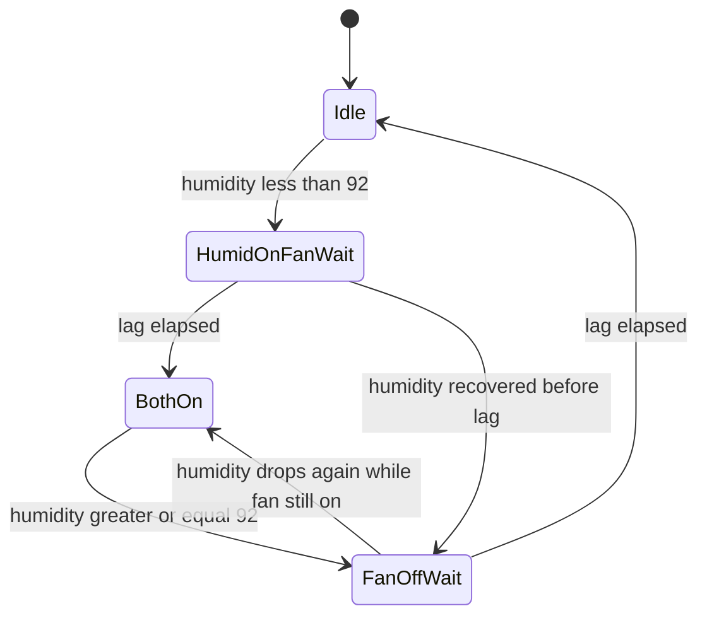

# Humidifier + fan relay control

## Hardware pins (avoid existing uses)

Already taken:

- **GPIO 21 / 22** — I2C (SHT31 + OLED)
- **GPIO 12 / 13** — temperature LEDs
- **GPIO 14 / 15** — humidity LEDs

Use two unused, boot-safe outputs:

- **GPIO 25 → relay IN1 → humidifier**
- **GPIO 26 → relay IN2 → fan**

Typical 2-channel modules (`GND`, `IN1`, `IN2`, `VCC`) are **active LOW** (IN pulled LOW = coil ON). Encode that as a `#define` so you can flip it if your board is active HIGH.

```
ESP32 GND  →  relay GND
ESP32 5V   →  relay VCC   (module coils are 5V; 3.3V GPIO is only the trigger)
GPIO 25    →  IN1  (humidifier)
GPIO 26    →  IN2  (fan)
```

Do not drive mains from the ESP. Load wiring stays on the relay COM/NO side.

## Control constants ([Config.h](MushroomController/Config.h))

Add tunables (not tied to LED `TARGET_HUMIDITY` 90 ± 5):

- `HUMIDIFIER_ON_BELOW_PCT` = `92.0f` — humidifier ON while humidity **&lt; 92**, OFF when **≥ 92**
- `FAN_LAG_AFTER_HUMIDIFIER_MS` = `5000` — fan ON 5 s after humidifier ON; fan OFF 5 s after humidifier OFF
- `HUMIDIFIER_RELAY_PIN` = `25`, `FAN_RELAY_PIN` = `26`
- `RELAY_ACTIVE_LOW` = `1`

Leave LED targets/tolerances unchanged.

## Logic (extend [StatusOutputs](MushroomController/StatusOutputs.cpp))

Keep LED behavior as-is. Add humidifier/fan relay state in the same class (README already points here for future relays).

State machine:



Rules:

- Valid reading, `humidity < HUMIDIFIER_ON_BELOW_PCT` → humidifier relay ON immediately.
- Fan turns ON only after `FAN_LAG_AFTER_HUMIDIFIER_MS` **while humidifier is still ON** (if humidity recovers in those 5 s, fan never starts).
- Humidifier OFF immediately when humidity ≥ 92 (or sensor invalid).
- Fan turns OFF `FAN_LAG_AFTER_HUMIDIFIER_MS` after humidifier OFF (clears remaining mist).
- Sensor fail / invalid reading: humidifier **and** fan **OFF immediately** (failsafe; skip the lag).

`millis()`-based timers; no blocking `delay(5000)`.

## Loop change ([MushroomController.ino](MushroomController/MushroomController.ino))

Today `loop()` returns early until the 2 s sensor interval, so a 5 s fan lag would be jumpy. Call `statusOutputs.loop()` **every** iteration (portal + MQTT stay as they are). `update()` still runs only on a new sensor reading; `loop()` only advances the fan timers and writes relay pins.

On boot, both relays OFF.

## README ([README.md](README.md))

Replace the “Future humidifier / cooler” stub with a **2-channel relay** wiring section:

- Pin map table (IN1/IN2 vs GPIO 25/26; do **not** use 12–15 or 21–22)
- Threshold and fan lag constants
- Active-LOW note and mains-on-relay-only warning
- Update file-structure + “Not built yet” (relays implemented; cooler still not)

No MQTT command path in this change — local humidity only.
